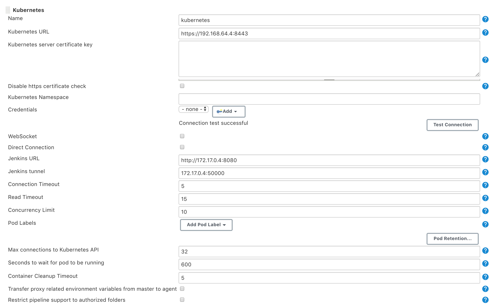
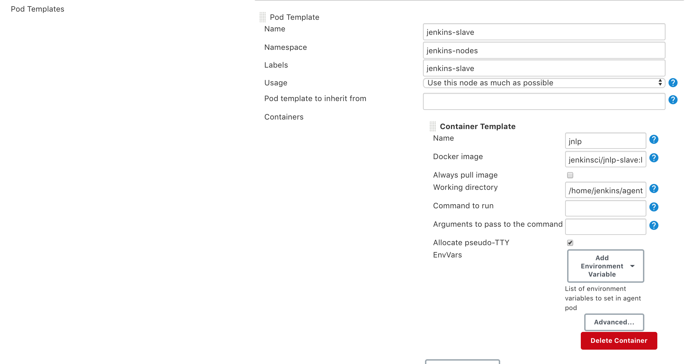
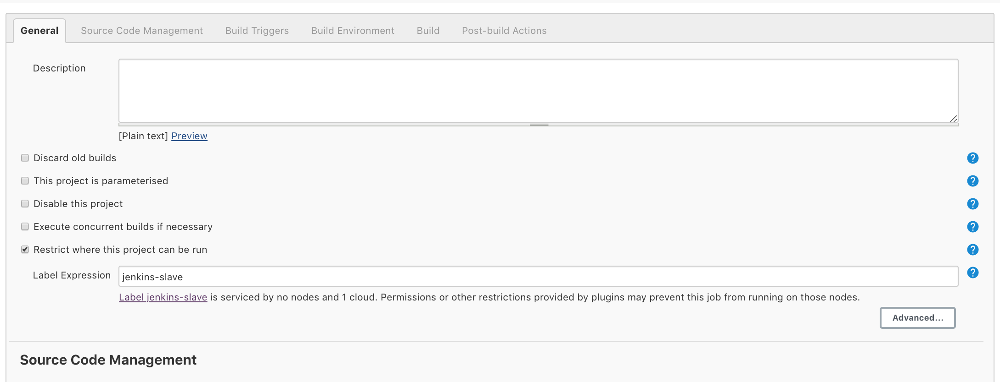
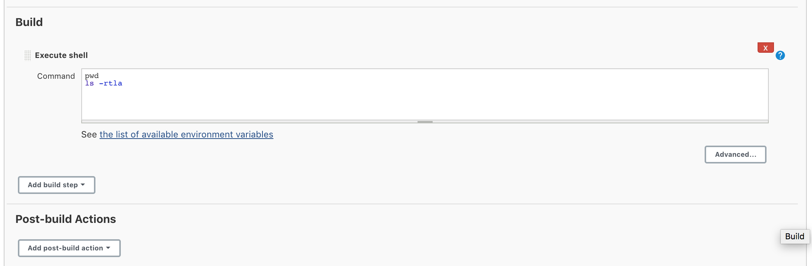

# jenkins-master-slave-k8s

This is a PoC for a Kubernetes stack running in **Minikube** the following:

* Jenkins Master (default namespace)
* Jenkins Slave (jenkins-nodes namespace)

Basically this is a single Master using the kubernetes plugin spawning Slave nodes on request whenever a new job gets built.

The jenkins master needs some manual configuration, as in the example below.

## Versions

This stack has been built in a Mac

 * kubectl

 ```
 Client Version: version.Info{Major:"1", Minor:"16+", GitVersion:"v1.16.6-beta.0", GitCommit:"e7f962ba86f4ce7033828210ca3556393c377bcc", GitTreeState:"clean", BuildDate:"2020-01-15T08:26:26Z", GoVersion:"go1.13.5", Compiler:"gc", Platform:"darwin/amd64"}
Server Version: version.Info{Major:"1", Minor:"18", GitVersion:"v1.18.3", GitCommit:"2e7996e3e2712684bc73f0dec0200d64eec7fe40", GitTreeState:"clean", BuildDate:"2020-05-20T12:43:34Z", GoVersion:"go1.13.9", Compiler:"gc", Platform:"linux/amd64"}
```

Minikube

```
minikube version: v1.11.0
commit: 57e2f55f47effe9ce396cea42a1e0eb4f611ebbd
```

Jenkins master - https://hub.docker.com/r/jenkins/jenkins/

```
DIGEST:sha256:3ee4bd15d77fdc7a784efd468f501a03b9baafad7ae3e3f29381af4653bde870
```

Jenkins slave - https://hub.docker.com/r/jenkinsci/jnlp-slave/

```
DIGEST:sha256:77983608c6f9715aa22c20f515054fe56178522f21be82d3aa972ac0e9564518
```

## Installation

This is pretty straigh-forward.

You need to first build the custom Docker Image and after to create/apply the Kubernetes resources.

I am using the LATEST jenkins image what means things can change in the near future and this code might stop working.

Feel free to customize the Dockerfile file with any other plugins and dependencies of your liking.

So just do: 

```
docker build -t my-jenkins-image:1.0 .
kubectl apply -f cluster-role.yaml
kubectl apply -f jenkins-deployment.yaml
kubectl apply -f jenkins-service.yaml
```

To use anything but Minikube, you will need to modify the *jenkins-service.yaml* 

The required internal ports are:
* 8080 (jenkins URL)
* 50000 (default JNLP)

## Jenkins Master Example Configuration

Whenever the Jenkins Master has been deployed, you just need the following:

* The Kubernetes URL for cluster
* Jenkins master internal IP





## Jenkins job Example Configuration

Given we are using as a label for the Kubernetes Node **jenkins-slave* this is very much straight forward.




```
Started by user unknown or anonymous
Running as SYSTEM
Agent jenkins-slave-1cvvk is provisioned from template jenkins-slave
---
apiVersion: "v1"
kind: "Pod"
metadata:
  labels:
    jenkins: "slave"
    jenkins/label: "jenkins-slave"
  name: "jenkins-slave-1cvvk"
spec:
  containers:
  - env:
    - name: "JENKINS_SECRET"
      value: "********"
    - name: "JENKINS_TUNNEL"
      value: "172.17.0.4:50000"
    - name: "JENKINS_AGENT_NAME"
      value: "jenkins-slave-1cvvk"
    - name: "JENKINS_NAME"
      value: "jenkins-slave-1cvvk"
    - name: "JENKINS_AGENT_WORKDIR"
      value: "/home/jenkins/agent"
    - name: "JENKINS_URL"
      value: "http://172.17.0.4:8080/"
    image: "jenkinsci/jnlp-slave:latest"
    imagePullPolicy: "IfNotPresent"
    name: "jnlp"
    resources:
      limits: {}
      requests: {}
    securityContext:
      privileged: false
    tty: true
    volumeMounts:
    - mountPath: "/home/jenkins/agent"
      name: "workspace-volume"
      readOnly: false
    workingDir: "/home/jenkins/agent"
  hostNetwork: false
  nodeSelector:
    kubernetes.io/os: "linux"
  restartPolicy: "Never"
  securityContext: {}
  volumes:
  - emptyDir:
      medium: ""
    name: "workspace-volume"

Building remotely on jenkins-slave-1cvvk (jenkins-slave) in workspace /home/jenkins/agent/workspace/test
[test] $ /bin/sh -xe /tmp/jenkins5799463642908412725.sh
+ pwd
/home/jenkins/agent/workspace/test
+ ls -rtla
total 8
drwxr-xr-x 3 jenkins jenkins 4096 Jun 15 15:30 ..
drwxr-xr-x 2 jenkins jenkins 4096 Jun 15 15:30 .
Finished: SUCCESS
```